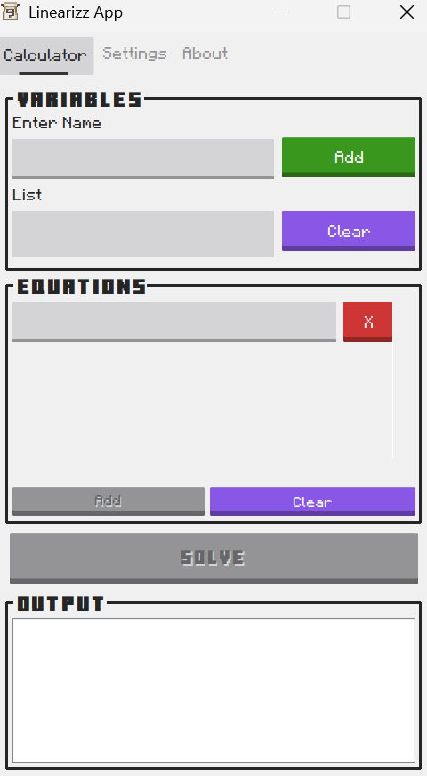
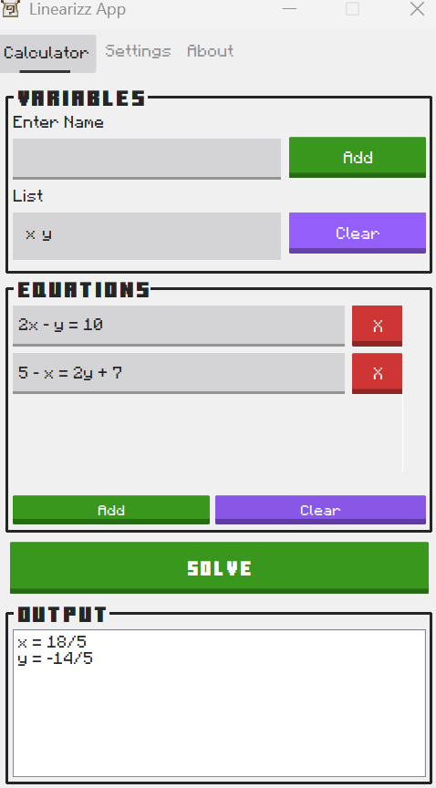
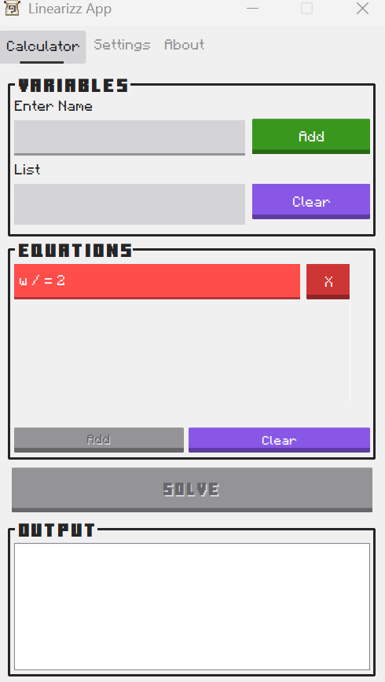

# Linearizz 🧮✨

Are you tired of manually solving systems of equations? (Especially when solving partial fractions in integrals) 🤔🤔

Linearizz does it for you in a few pindot2x!!!

NOTE: This application is a CCC102 Finals Project showcasing OOP and Swing GUI skills I've learned throughout the semester. 💻

## What Does It Look Like?
<p float="left">



</p>

## Features
This is how you use the application:
1. Enter variables (manual register mode by default).
2. Input equations in the provided fields.
3. Click solve and view results in fraction or decimal form.

The application identifies whether the system has:
* exactly one solution
* no solution
* infinitely many solutions
* undetermined or overdetermined cases (#equations != #variables)

In case you enter the wrong syntax of the variable name or the equation, error handling with contextual tooltips will guide you to correct typos or malformed equations.

The application provides configurable calculator settings:
* variable register mode:
   * manual (default): you explicitly add each variable name before solving
   * automatic: variables are automatically added from your equation input.
* output mode:
   * fraction (default): solutions are displayed as exact fractions
   * decimal: solutions are displayed in decimal form (note the consequences of using binary floating-point as a data type)

In order for you to know how to enter valid variable names or equations, here is the guide or grammar for these:
* variable names must start with one letter and may be followed by digits (e.g. `x`, `y1`, `z0001`)
* equation grammar:
```
<equation>      ::= <expr> '=' <expr>
<expr>          ::= <term> { <term> }
<term>          ::= <constant-term>
                  | <variable-term>
<constant-term> ::= ['+'|'-'] <number>
<variable-term> ::= ['+'|'-'] <variable-name>
                  | ['+'|'-'] <number-atom> <variable-name>
                  | ['+'|'-'] <variable-name> '/' <number-atom>
                  | ['+'|'-'] <number-atom> <variable-name> '/' <number-atom>
<number>        ::= <number-atom> [ '/' <number-atom> ]
<number-atom>   ::= digits [ '.' ] | [ '.' ] digits
<variable-name> ::= letter { digit }
```
   * you can only have a linear term for each in the expression on both sides of the equation (that's why it is linear equation)
   * there is only a limited set of arithmetic operations used (no exponents, no grouping, no other functions)
     * each term is separated by `+` or `-` and each number can be a fraction or a decimal

## How to Download?
You can get the latest prerelease [here](https://github.com/cooky922/Linearizz/releases/tag/v0.2-beta)

[NOTE: the prebuilt `.jar` file requires you to run on JVM environment of JDK 24 installed on your desktop]

## How to Reproduce the Application using Source Files?

1. 🔨 **Build:**
```bash
make
```

2. ▶️ **Run:**
```bash
make run
```
   
## Milestone
Backend:
- [x] Algorithm Design
- [x] Algorithm Implementation
- [X] Algorithm Testing

Frontend:
- [X] GUI Design
- [X] GUI Implementation
- [X] GUI Functionality Implementation
      
Final Stages:
- [X] Final Fixes
- [X] Testing
- [ ] Deployment
