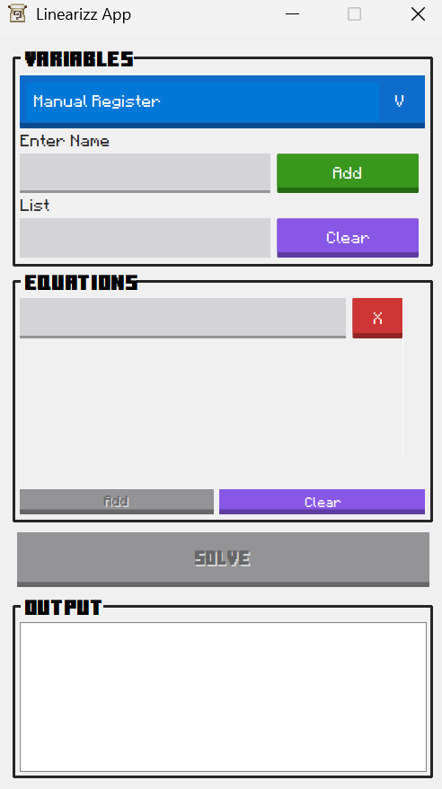
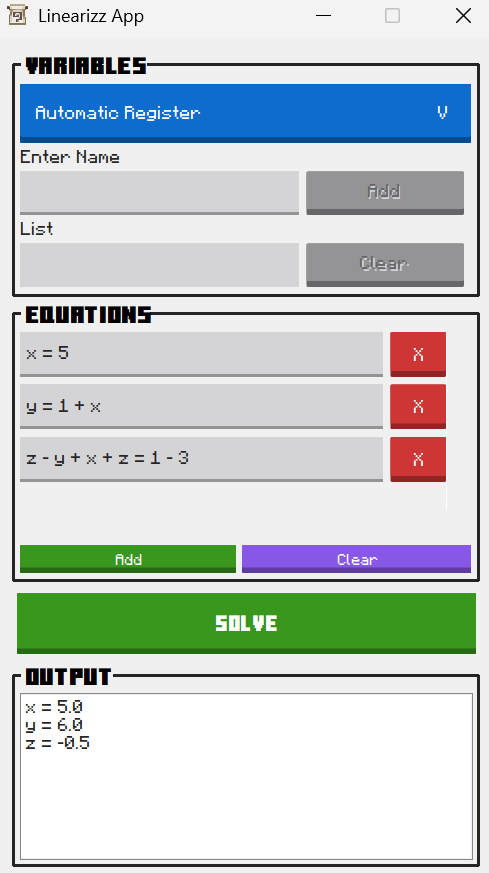
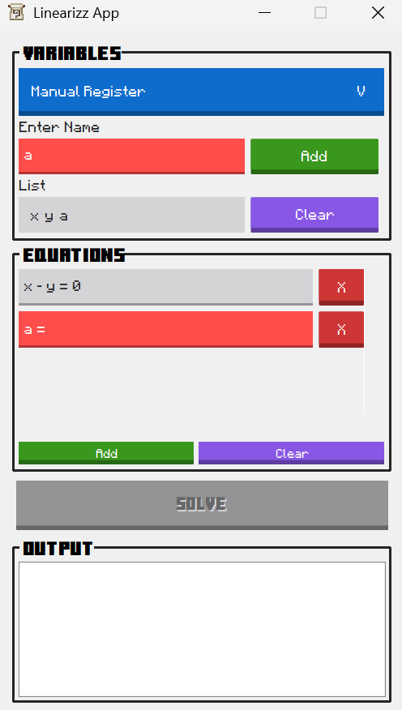

# Linearizz 🧮✨

Are you tired of manually solving systems of equations? (Especially when solving partial fractions in integrals) 🤔🤔

Linearizz does it for you in a few pindot2x!!!

NOTE: This application is a CCC102 Finals Project showcasing OOP and Swing GUI skills I've learned throughout the semester. 💻

## What Does It Look Like?
<p float="left">



</p>

## Features
This calculator application offers two modes:
* Manual Variable Register
* Automatic Variable Register

Before solving equations, the user must configure what variables to use. In the case of manual mode, the user has to manually add the variables needed. Otherwise, the variables will be automatically registered based on the equations input.

Before clicking the solve button, the user has to give equations to solve which are only limited to simple expressions (no multiplication nor division). As stated in the title, the calculator tries to solve the system of linear equations and gives one of the possible outputs:
* the system has exactly one solution
* the system has no solutions (inconsistent system)
* the system has infinitely many solutions
* the system is underdetermined (the system may have infinitely many solutions)
* the system is overdetermined (the system may have no solutions)

Of course, error handling has been implemented in such a way that the user can easily fix based on the given suggestions by the application. The application will give hints by providing tooltips that display appropriate error messages.

## How to Download?
You can get the latest prerelease [here](https://github.com/cooky922/Linearizz/releases/tag/v0.1-beta)

## How to Reproduce the Application using Source Files?

1. 🔨 **Build:**
```bash
make
```

2. ▶️ **Run:**
```bash
make run
```
   
## Milestone
Backend:
- [x] Algorithm Design
- [x] Algorithm Implementation
- [X] Algorithm Testing

Frontend:
- [X] GUI Design
- [X] GUI Implementation
- [X] GUI Functionality Implementation
      
Final Stages:
- [ ] Final Fixes
- [ ] Testing
- [ ] Deployment
